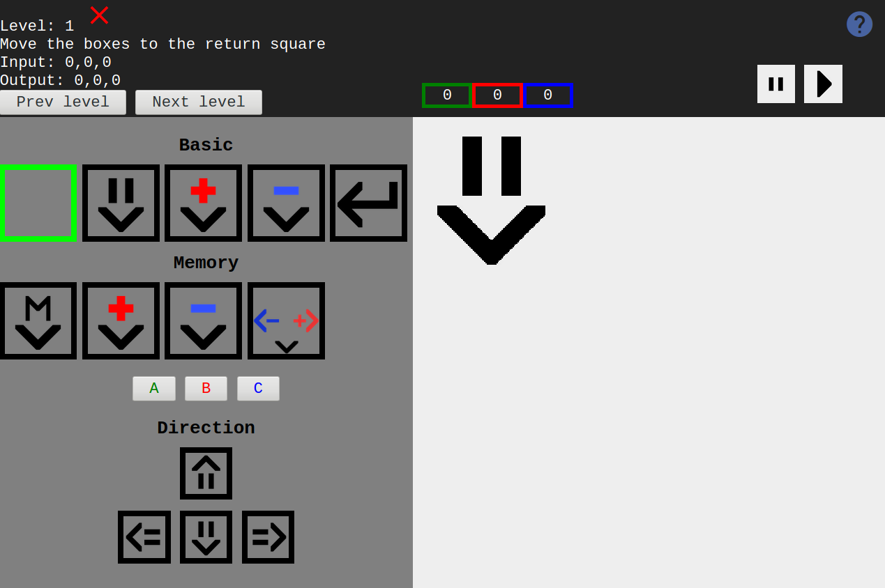
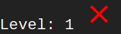
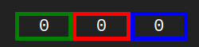
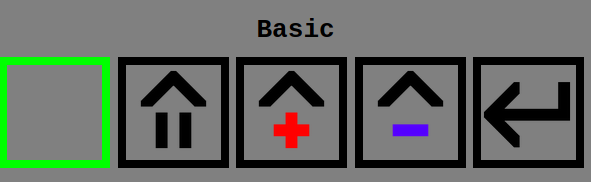
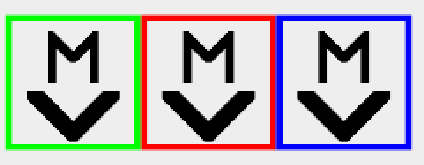

# Here comes a guide, dudududu

Welcome to Factorithm!
Factorithm is a game about algorithms, (not so) cleverly disguised as a factory simulator.
If you are new to this game, it might be helpful to have a look at this guide.
It contains an explanation of the game mechanics and the goal of the game.

## Interface

An explanation of the interface might be in order.
It wasn't easy cramming this much information into such a small interface, work with me here.

Here is the whole thing, let's break it down a bit.

### Level info

This section contains information about the current level, and buttons to switch between levels.
The first line shows which level you are currently on, and whether or not you have completed the level.

If you see this, the level has not been completed.

If you see this, great job!

Next, there's the input and output.
The input is the initial values your algorithm will recieve.
Your goal is to manipulate the value of the input to match the output.
In this case, you would first need to change the 1 to -2, then 2 to -1, and finally 3 to 0.

Finally, there's the buttons to switch between levels.
These should be fairly self-explanatory.

### Conveyor picker

Here you can choose between all the different conveyors.
These are the mathematical or computational operations that can be performed on The Box™.
We have addition, we have subtraction, we have conditionals, we have it all.
You can choose which direction the conveyors face by clicking the arrow keys.
Tired of clicking the arrows all the time? You can also use the arrow keys on your keyboard!

### Memory info

See those sneaky little ABC buttons in the conveyor picker?
They control which memory cell to use.

These are the memory cells.
They allow you to store a numerical value throughout the runtime of the algorithm.
The Memory row in the conveyor picker has all the conveyors that work with these values.

### Game board

This is the game board.
This is where you place conveyors and try out your algorithms.
When you are happy with your conveyor placement, you can press the play button to the top right to start a run.

## Game mechanics

### Conveyors and The Box™

#### The Box™

When you press play, you are given a box with a numerical value according to the level input.

This is The Box™.

The objective of the game is to submit The Box™ with the right numerical value for all inputs according to the level output.

#### Basic conveyors

These are the basic conveyors.
They can perform elementary operations on The Box™.

Except this guy, this one is just there to remove misplaced conveyors. We all make mistakes, we are human after all.

These are the movement conveyors.
The first conveyor simply moves The Box™ one square in one direction.
The next two conveyors either add or subtract one from the value of The Box™, and move the box.

This is the submit conveyor. Use this to submit The Box™ for review.
If all the numerical values match the expected outputs, you done solved that level!

### Memory

Normal adding and subtracting wouldn't get us very far, would it?
This is where it gets a bit hairy, so strap in.
I believe in you.
You can do it.

#### Memory cells

These are the memory cells.
They allow you to store a numerical value throughout the runtime of the algorithm.
Using the memory conveyors, you can use these cells to perform more complex operations where you need to store a value for later.

#### Memory conveyors

These are the memory conveyors. They perform operations on memory cells.
Clicking the ABC buttons will choose which memory cell each conveyor is bound to.

The colored border in the playing field indicates which memory cell the conveyor is bound to.

This is the assignment conveyor.
It sets the value of the memory cell it is bound to to be the same as the current value of the box. Using this, you can store a value for use later.

These are the addition and subtraction conveyors.
They increment or decrement the value of a memory cell by one.

Finally, there is the conditional conveyor.
This is likely the most important conveyor in the game.
It allows you to control the movement of The Box™ based on the value of a memory cell.
If the value of the cell is positive, The Box™ moves in the direction of the red arrow.
If it is negative, The Box™ moves in the direction of the blue arrow.
If the value of the cell is zero, it moves in the direction of the black arrow.

## You got through it, well done

That's all folks. You now have all the knowledge needed to deal with what the game throws at you. I hope you enjoy playing, thank you!